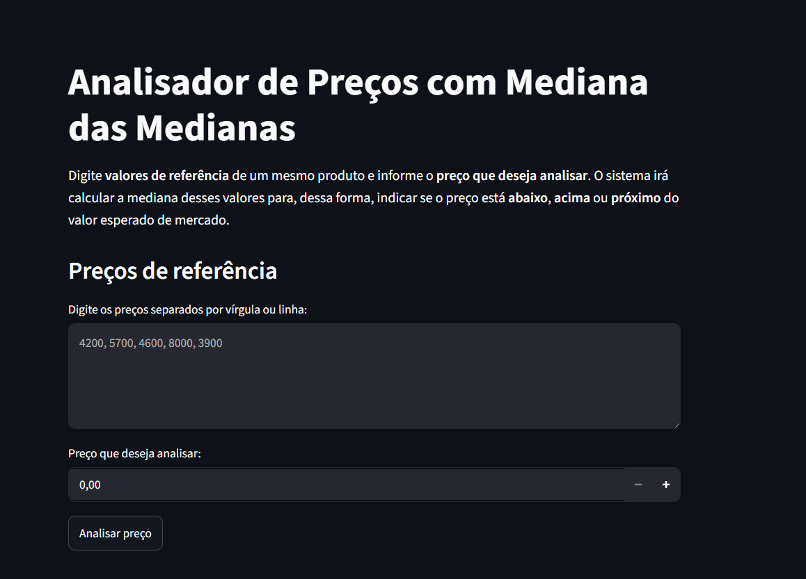
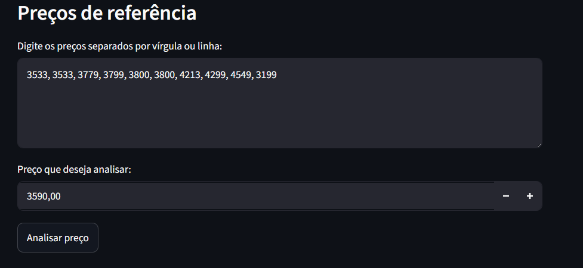
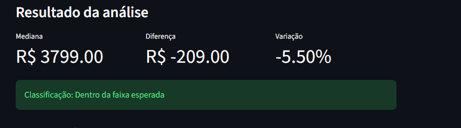

# Analisador de Preços

**Número da Lista**: 3<br>
**Conteúdo da Disciplina**: Dividir e Conquistar<br>

## Alunos
| Matrícula | Aluno |
| -- | -- |
| 23/1011220 | Davi Camilo Menezes |
| 23/1011800 | Rafael Welz Schadt |

## Sobre
O objetivo do **Analisador de Preços** é comparar preços de mercado com o preço-alvo estimado pelo usuário. O software faz uso do algoritmo "Mediana das Medianas" para verificar a mediana dos valores de forma rápida e escalável. Ao utilizar esse algoritmo, evita-se preços muito deslocados (muito altos ou muito baixos), já que a Mediana das Medianas sempre exclui extremos, evitando golpes ou preços superfaturados.

## Screenshots
Tela de início, sem nenhum dado:


Informações preenchidas:


Algoritmo executado e análise feita:


## Instalação
**Linguagem**: Python<br>
**Framework**: Streamlit<br>
**Pré-requisitos:** Todos os requirements instalados<br>

### Como rodar
1. Clonar o repositório para a sua máquina
```bash
git clone https://github.com/projeto-de-algoritmos-2026/DeC_Analisador-de-precos.git
```

2. Navegar até o diretório do projeto
```bash
cd DeC_Analisador-de-precos
```

3. Instalar as dependências
```bash
python -m pip install -r requirements.txt
```

4. Entrar na pasta `src`
```bash
cd src
```

5. Executar a aplicação
```bash
python -m streamlit run main.py
```

**Observações**
- A aplicação é executada localmente por meio do *Streamlit* e disponibilizada em uma interface web, a qual é aberta automaticamente no navegador.
- Se `python` não estiver disponível no seu terminal, use `python3` nos comandos acima.

## Uso
Conforme as screenshots do trabalho, ao iniciar a aplicação, o usuário terá acesso a uma interface web interativa para análise de preços. O sistema disponibiliza os seguintes campos e funcionalidades:

**Preços de referência:** área destinada à inserção dos preços de mercado do produto, os quais podem ser informados separados por vírgulas ou por linhas.

**Preço que deseja analisar:** campo onde o usuário informa o valor que deseja comparar com os preços de referência anteriormente digitados.

**Analisar preço:** executa o algoritmo de seleção baseado em **Mediana das Medianas** para encontrar a mediana da amostra e realizar a análise do valor informado.

**Resultado da análise:** exibe, respectivamente, a mediana calculada, a diferença entre o preço analisado e a mediana, a variação percentual e a classificação do preço.

O sistema classifica automaticamente o preço informado em uma das seguintes categorias:

- **Barato:** quando o valor está significativamente abaixo (pelo menos 15% menor) da mediana dos preços de referência;
- **Dentro da faixa esperada:** quando o valor está próximo da mediana (no intervalo de 15% menor ou maior);
- **Caro:** quando o valor está significativamente acima (no mínimo 15% maior) da mediana dos preços de referência.

Além disso, a aplicação apresenta uma tabela contendo todos os dados informados (preços de referência) e uma conclusão da análise realizada, permitindo ao usuário compreender facilmente como o resultado foi obtido, e utilizar as informações de acordo com suas necessidades pessoais.

## Vídeo de Apresentação
Link para o vídeo de apresentação e demonstração do trabalho: [Clique aqui](https://youtu.be/L-EBFDB6PZo)
